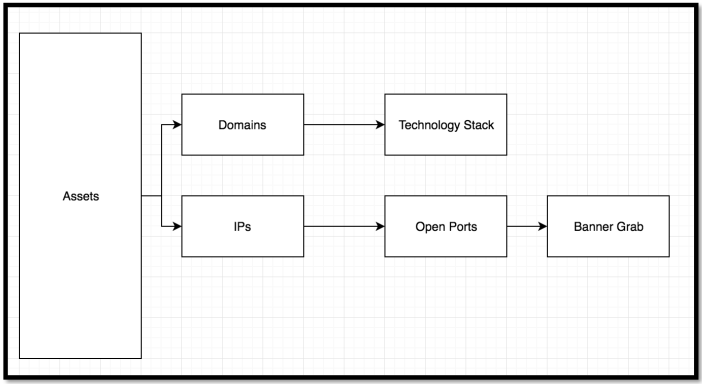

# Fingerprinting Phase
## Introduction
- The reconnaissance phase is all about finding your targets assets and endpoints.After you find your targets assets you need to fingerprint them. 


- The purpose of fingerprinting is to find out what technologies are running on your target’s assets.You want to know the technology stacks, version numbers, running services, and anything else that can be used to identify what's running on an endpoint.

---

## 1. IP

### 1.1 Introduction
- During the reconnaissance we gathered CIDR ranges belonging to our target. IP address were also gathered from the DNS resolutions of the target’s subdomains during the subdomain enumeration phase.
-  These are the two main ways offinding IPs associated with an organization. Once you have a list of IPs you will want to discover the ports and services running on that endpoint.
### 1.2 Shodan
- [Shodan](https://www.shodan.io/) is the most popular resource for gathering port scan data. This service scans the entire internet on a daily basis and provides this data to its users.
- If you have your targets CIDR range you can use that to query Shodan. This will display all assets in that CIDR range that have an open port.
``` bash
net:<”CIDR,CIDR,CIDR”>
```
-  You can also search via the organizations name.
-  One technique you can use is to search for a company's SSL certificate. SSL certificates should have the companies name in them so you can use this to find other assets belonging to an organization.

### 1.3 Censys
- Censys does the same thing Shodan does it’s basically a Shodan clone.
- [https://censys.io/ipv4](https://censys.io/ipv4)
- You can often find assets on Censys that aren't on Shodan and vice versa.
### 1.4 NMAP
- Nmap does a really good job when scanning a small range of hosts but if you are trying to scan a large organization it’s probably not the right tool.
- Nmap is really good at doing a thorough scan, so if you want to scan and enumerate every port on a machine use Nmap.
### 1.5 Masscan
- Mass scanners are really good at detecting a single port across a huge range of IPs. The tool Masscan was built to scan the entire internet in just a few hours so it should be able to scan a large organization with ease.
- https://github.com/robertdavidgraham/masscan
```bash
sudo masscan -p<Port Here> <CIDR Range Here> --exclude  Exclude IP> --banners -oX <Out File Name> ```
```
<hr>

## 2. Web Applications

### 2.1 Introduction
- When dealing with domains or web applications we want to perform some additional fingerprinting. We want to know the technology stack, programming languages used, firewalls used, and more. Remember web applications can be found on both IPs and domains, most people forgot about the IPs during this phase.

### 2.2 Wappalyzer
- Wappalyzer is by far the best tool for identifying web technologies. Basically, the tool analyzes an applications source code using a bunch of regexes to find out what technologies its running. You can download an extension for your browser.

### 2.3 Firewall
- It’s not uncommon to see an application protected by a web application firewall (WAF). Before you start throwing a bunch of XSS payloads at a target you should check to see if there is a WAF.
- https://github.com/EnableSecurity/wafw00f
```bash
 wafoof <URL>
```
- 
- The hacking community has been bypassing WAFs ever since the first WAF came out and much of it is documented.
	- https://github.com/0xInfection/Awesome-WAF#known-bypasses

## Conclusion
- If your testing a web application it’s a good idea to see if it’s protected by a firewall. Web application firewalls (WAFs) are designed to block malicious attacks such as XSS but they all seem to contain bypasses. 
- If you discover an application is behind a WAF you need to adjust your payloads so they are able to bypass the firewall. It does no good to spend hours testing for XSS if it’s getting
blocked by a WAF, work smarter not harder.
