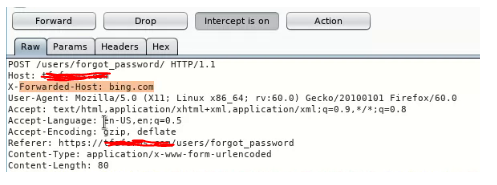
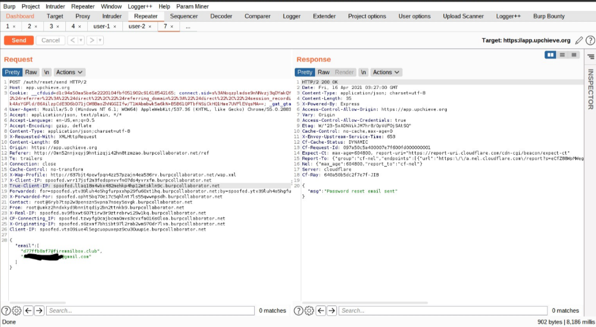

# Password Reset Flaws
### Method 1 : Host Header 
1.  Go to [https://redacted.com/users/forgot\_password](https://redacted.com/users/forgot_password) and type username to get forget password link.
2.  Capture this request in Burpsuite and add <b>X-Forwarded-Host: bing.com</b>

	
3. Then forward the request and check your email. You got an email of Password reset with token. Which looks Like ([https://bing.com/users/reset\_password/tqo4Xciu806oiR1FjX8RtIUc1DTcm1B5Kqb53j1fLEkzMW2GPgCpuEODDStpRaES](https://redacted.com/users/reset_password/tqo4Xciu806oiR1FjX8RtIUc1DTcm1B5Kqb53j1fLEkzMW2GPgCpuEODDStpRaES)).
4. Here token is Leak to the bing.com. So Now to confirm this token is True or not. Put [https://redacted.com](https://redacted.com/) instead of [https://bing.com](https://hackerone.com/redirect?signature=6b4c48def3047486a33dd3013d8956a4d8263bc8&url=https%3A%2F%2Fbing.com) and open in browser.

5. So the password reset link is valid and i can able to reset the password.

### Exploitation
1. Create a server via ngrok and consider it as an Attacker's server.
2.  Then Attacker go to the page which is [https://redacted.com/users/forgot\_password](https://redacted.com/users/forgot_password) and type **Victim** username and capture the request in Burp suite.
3.  In captured request Attacker add “**X-Forwarded-Host: ngrok.io**” ngrok.io=ngrok server address.
	
4. . So after that Victim can get the Password reset URL and the domain of that reset link is ngrok server address or domain. (For the exploitation It need victim interaction or one time click only)
5.  Whenever victim is click on that link. Attacker can get the full token in his server.
6.   When attacker can get the password reset token he will only change the ngrok domain name to Main Domain to Takeover the Account.
---

### Method 2 : HTTP Parameter Pollution
1.  Go to [https://anywebsite.com/forgot/](https://dash.readme.io/forgot/)
2.  Start Burp Proxy and start intercepting requests
3.  Enter the email address of the victim on the website and click submit
4.  intercept request on burp and add another email parameter with the attacker’s email address and forward the request
5.  Now you will receive the email from readme regarding account password reset.

---

### Method 3: Modifing the JSON, to send Pswd Reset Mail on multiple Email IDs
- If in the reset password request there is a post Json parameter => email	
```json
“email":”me@mail.com”
```
and the response is
```json
“msg”:”password reset email sent”
```
Try to make the email parameter value as an Array with 2 mails to manipulate the functionality and send the email link to email1 and email2
```json
{
	“email”:[”victimMail”,”attackerMail"]
}
```

If you're lucky the password Reset link will be send to both the Emails.

**Tip** :- In reset password request
1.  use content type converter burp ext
2. convert the request to json , if the application accepted it try this trick
3. convert the request to xml and if the application accepted it u can try xxe
---