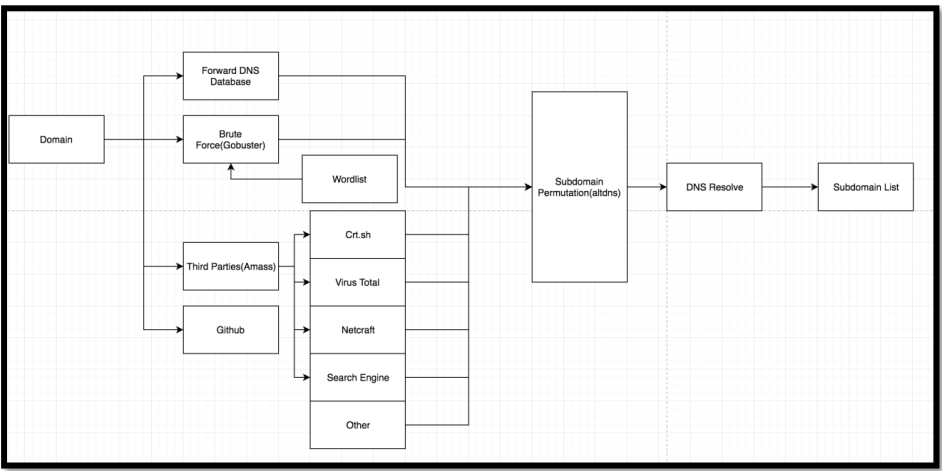
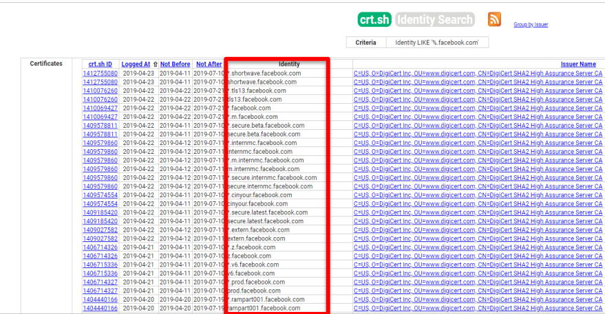
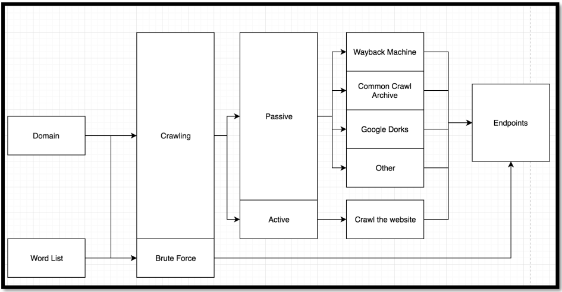

# Reconnaissance [Phase 2]
## 1. Wordlists
Word lists are used to find new subdomains, interesting files, cracking passwords, and much more.
#### 1.1 Sec List
- If you’re looking for a good wordlist this should be the first place you look, chances are they have the wordlist you're looking for.
	-  https://github.com/danielmiessler/SecLists
	-  <b>Robots Disallow</b>: The robots.txt disallow directory is used to tell scraping bots such as google to not crawl certain files and file paths, this can be a good indication that they are trying to hide something.
	-  <b>RAFT</b>: The RAFT wordlists contains a large number of interesting filenames and directories. There are several different versions of this list ranging in size but I generally just go with the largest list.
	-  <b>Technology Specific</b>:  Seclists contains specific wordlists for PHP, Golang, ASP, Apache, IIS, and a bunch more.
#### 1.2 Common Speak
- https://github.com/assetnote/commonspeak2
-  https://github.com/assetnote/commonspeak2-wordlists
-  Common speak from Assetnote has a unique way of generating wordlists. 
#### 1.3 All
- The majority of people use this wordlist for subdomain brute forcing.
- You won’t find a bigger word list than this one.
	-  https://gist.github.com/jhaddix/86a06c5dc309d08580a018c66354a056

#### 1.4 CRTSH
- Every https domain is logged in a database somewhere. Internetwache created a tool to scrape this database for subdomains. Every hour Internetwache uses this tool to update his wordlist.
	- https://github.com/internetwache/CT_subdomains	
	- 
<hr>

## 2. Subdomain Enumeration
#### 2.1 Certification Transparency Logs
- Any site that starts with HTTPS:// uses SSL certificates to provide a secure connection. If a hacker or rogue certificate authority is able to forge this certificate they would be able to perform man in the middle attacks.
- 
- The certificate transparency log is used to monitor and audit unauthorized certificates. Every time you get an SSL certificate for your domain or subdomain it will be logged in certificate transparency logs
- We can find all SSL certificates belonging to a domain by issuing a GET request to https://crt.sh/?q=%25.facebook.com as shown below:
	- 
- <b>Tools</b>:
	- [Crtsh.py](https://github.com/ghostlulzhacks/CertificateTransparencyLogs)
#### 2.2 Search Engine
- Google dorks can be utilized to find subdomains with the following dork:
	- Site: 
		- This dork wil return all the links belonging to a specific domain. 
		 
#### 2.4 Github 
- Almost every developer uses GitHub to store their source code. Developers will often hard code private or hidden endpoint points in their source code. 
- Tool : [Github-Search](https://github.com/gwen001/github-search/blob/master/github-subdomains.py) by [gwen001](https://github.com/gwen001).

#### 2.5 Brute Force
- Brute forcing is probably the most popular way to find subdomains. You might think that you send a get requests to a bunch of subdomains and see which ones resolve but that’s wrong. DNS can be used to brute force subdomains without sending packets to your target. All you do is perform a DNS requests against a subdomain if it resolves to an IP then you know it’s live. 
- <b>GoBuster</b>: [GoBuster](https://github.com/OJ/gobuster) is a good tool for discovering the directories hosted on a web server as well as a enumerating the Subdomains. 
	- It is however dependent on how good wordlist are you using for the enumeratoin.
#### 2.6 Subdomain Permutation
- One of the best ways to find hidden assets is through the use of permutations. A permutation is a way a set of words can be rearranged. 
- For example, if we have the subdomain test.starbcuks.com and the words dev, stage, and production we could come up with several possible subdomains. We would have dev-test.starbucks.com, dev.test.starbucks.com, production-test.starbucks.com, andso on. 
- All this can be done automatically with altdns:
	- [Altdns](https://github.com/infosec-au/altdns)
		- Using altdns we can pass in a list of found subdomains and a list of words and the tool will output a huge list of permutations. The tool can also resolve eachnewly found subdomain to see if they are live:
		- ``` 
		altdns -i found_subdomains.txt -o permutation_output -w words.txt -r -s resolved_output.txt ```
	- Other Tools: There are a lot of other techniques and resources that people can use to find subdomains.
		- Virus Total
		-  Netcraft
		-   DNSdumpster
		-  Threat crowed
		-  Shodan
		-  Cencys
		-  DNSdb
		-  Pastebin
		
#### 2.7 Tools
1. Amass:
	- https://github.com/OWASP/Amass
	- Amass will utilize a bunch of online resources to find subdomains. Most of these are third party vendors which they scrape or utilize their API to pull a listsubdomains.
2. Knock.py:
	- https://github.com/guelfoweb/knock
	-  it shows the response status and the technology stack. This is very useful for quickly understanding each subdomain.

<hr>

## 3. DNS Resolutions
- During the subdomain enumeration process, you should have generated a large list subdomains. In order to start probing these endpoints you need to know which ones are live.
-  To do this we can perform a DNS lookup against a domain to see if it contains an A record.
-  [Massdns](https://github.com/blechschmidt/massdns): The tool is written in C and requires us to build it before we can use it.

<hr>

## 4. Screen Shot
- When you’re dealing with thousands of targets it is much easier to scroll through a bunch of screenshots than visiting each site manually. Just by looking at a screen shot you can determine several things such as its technology, is it old, does it look interesting, is there login functionality, and much more.
- [Eyewitness](https://github.com/FortyNorthSecurity/EyeWitness):  It attempts to take a screenshot of each domain in the list that was passed to the tool. Once the tool is finished you can scroll through each of the screen shots to find interesting endpoints.

<hr>

## 5. Content Discovery
- Content discovery is a vital process in the reconnaissance phase. Failing to perform this phase properly will result in lots of missed vulnerabilities. The main purpose behind content discovery is to find endpoints on a target domain. 
- You are looking for things such as log files, config files, interesting technologies or applications, and anything else that is hosted on the website.
 

#### 5.1 Self Crawl
- One of the best ways to find endpoints on a target is to crawl the application. Crawling a website involves recursively visiting each link and saving each link on a web page recursively.
- Tool: [Crawler](https://github.com/ghostlulzhacks/crawler/tree/master).

#### 5.2 Wayback Machine Crawl Data
- The Wayback Machine is an archive of the entire internet. Basically, they go to every website and they crawl it while  taking screenshots and logging the data to a database.
- interesting filters include:
	-  .zip
	- .config
	- /admin/
	- /api/
- Once you get the data start looking for interesting files and GET parameters that might be vulnerable.


#### 5.3 Common Crawl Data
- like the Wayback Machine this data is publicly available and
we can use it to get a list of endpoints on a site passively. 
	- http://commoncrawl.org/
- The following script can be used to query the data provided by common crawl:
	-  https://github.com/ghostlulzhacks/commoncrawl

#### 5.4 Directory Brute Force
- Depending on your wordlists you can find all kinds of interesting endpoints like backup files, core dumps, config files, and a whole lot more.
- Tool: [GoBuster](https://github.com/OJ/gobuster)

<hr>
## 6. Inspecting JS Files 


#### 6.1 Link Finder
#### 6.2 JSearch
<hr>

## 7. Google Dorks
#### 7.1 Dork Basics
#### 7.2 Third Party Vendors
#### 7.3 Content
#### 7.4 